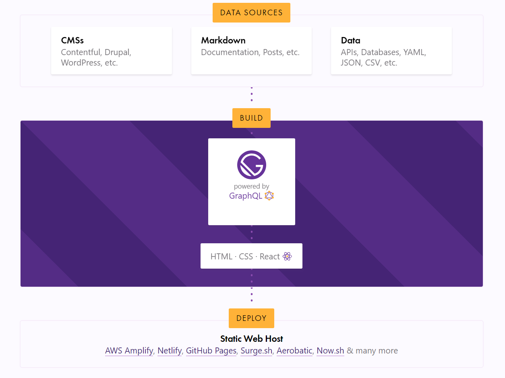
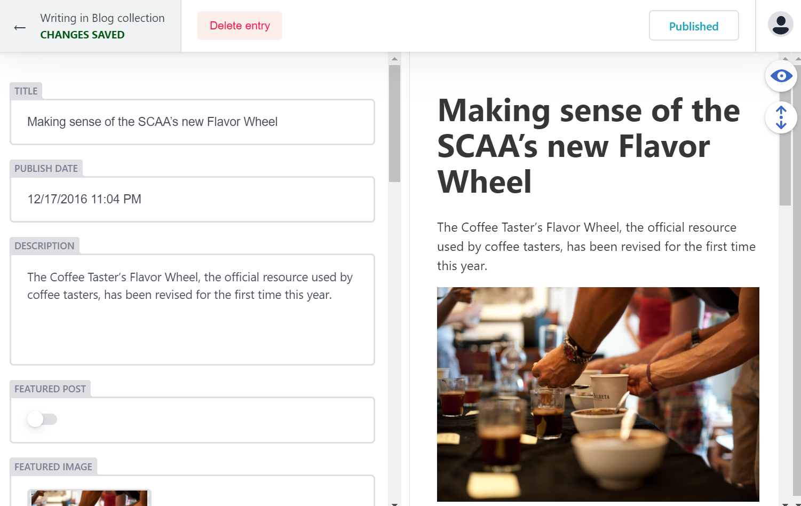
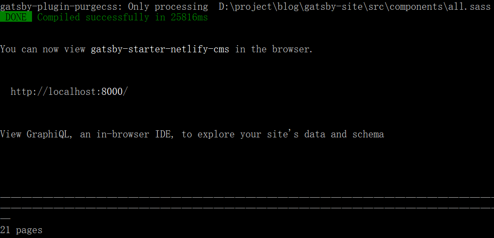

夏天即将过去，各位在这个暑假里一定收获不少，如果能有一个地方能够记录自己的学习的点滴，并将成果展示给其他访客，对于自己未来发展将会是极大的帮助。目前市面上有许多博客服务提供商，例如CSDN、简书、Medium等，只需要注册账号，我们就可以在这些网站上撰写自己的博客。在这些网站上，使用Markdown撰写博客，就能写出非常优雅的文章。但如果我们想更进一步，更加个性化地定制自己的主页，这时就需要考虑搭建自己的服务器了。如果网站以静态内容为主，我们有性价比更高的方案：Github Pages 和 Netlify 。


## 静态化网站的优点

### 性价比高

通常的动态网站分为前后端，后端的服务器在收到客户端访问请求后，通常需要执行对数据库的读写操作，然后将结果渲染成前端页面，返回给客户端。这一过程中，数据库读写和渲染页面都需要大量的计算资源，当访问量增长时，CPU、内存都需要随之扩展，带来了沉重的成本负担。


为了缓解计算资源紧缺的情况，目前的服务端大多都提供了页面静态化缓存，能够将常用的页面缓存为静态页面，节省运算量，加速网站的响应。如果网站主要提供静态内容，例如个人博客或者产品文档，将整个网站静态化能够节省大量服务器维护的成本。


通常，最低配置的云主机一年也需要300元左右，但将网页静态化后，就可以将网页放在Github Pages这样的免费空间，得益于服务提供商的CDN，访问速度和稳定性要比自建网站好上不少，而且不用费心维护，既省钱又省力。


### 易于备份迁移

如果需要备份或者迁移网站，只需要 git clone 即可，即使免费空间不再提供服务，我们也可以将网页放在我们自己搭建的服务器上。


### 安全

静态网站的内容都是预先生成的，不用担心 SQL 注入等问题。而且内容存放在 Git 仓库中，修改都会有记录。使用 Github Pages 这样的免费空间的话，也不用亲自去修复漏洞。所以对于新建网站来说，托管网站是十分安全的选择。

 


## 静态网站生成工具的选择

生成工具将决定未来网站的运营成本，因此需要细致地选择生成工具，个人认为有如下几点选择标准，可供参考：

- 社区的活跃程度（项目的 Star/Fork 数量）

- 语言的流行程度

- 插件的丰富程度

本文使用 Gatsby 作为静态网站生成工具，各位可以在 [StaticGen](https://www.staticgen.com/	"staticgen") 选择自己习惯使用的语言所编写的工具。


Gatsby 可以在本地生成网站，另外 Netlify 也提供了对Gatsby的支持，可以一键克隆搭建，下面就对这两种方法分别进行介绍。


## 一键部署到 Netlify 

只要点击[这里](https://app.netlify.com/start/deploy?repository=https://github.com/netlify-templates/gatsby-starter-netlify-cms&stack=cms)，注册 Netlify 账号，按步骤授权自己的 Github 仓库账号的权限，就可以自动部署 Gatsby 的博客了。而且 Netlify 提供了后台的接口，只需要访问 https://xxx.netlify.com/admin 即可在线发布修改博客（xxx为你自定义的网站名）





Netlify 后台每月上传的免费流量是有限额的，如果超出限额，我们可以将仓库中的内容 clone 到本地，写好新的文章再 push 回去。Netlify 检测到仓库有更新，会自动发布最新版的网站。


## 手动搭建本地环境

> 本部分使用 Windows 10作为示例环境

由于大部分资源来自外网，因此所需的时间由网络因素决定。


### 准备环境

> 本段参考自 [Gatsby 官方文档](https://www.gatsbyjs.org/docs/) 

Gatsby 需要的环境：

- Node.js >= 8.0.0
- Git 


#### 安装Node.js

前往 [Node.js 官网](https://nodejs.org/en/) 或其他网站下载 Node.js 安装包，本文选用10.16.0 LTS版本。

安装完成后首先用管理员权限打开 cmd ，更新 npm ，否则后续安装时会找不到新版的依赖包。

```shell
npm install -g npm
```

之后需要安装 node-gyp ，包含 python2.7 和Visual Studio Build Tools ，用于解决部分组件编译失败的问题，如果需要手动安装请参考[这里](https://github.com/nodejs/node-gyp#option-1)。

```shell
npm install --global --production windows-build-tools
npm install -g node-gyp
```


#### 安装 Git

前往 [Git 官网](https://git-scm.com/) 或其他网站下载 Git 客户端，本文选用2.22.0版本。

安装完成后打开 cmd 或 git bash 配置个人信息。

```shell
git config --global user.email "you@example.com"
git config --global user.name "Your Name"
```


#### 安装 Gatsby

Node.js 安装完成后，在开始菜单中搜索 cmd ，并用管理员权限打开，执行下列命令安装 Gatsby

``` shell
npm install -g gatsby-cli
```

显示下列信息即为安装成功

```shell
+ gatsby-cli@2.7.21
added 313 packages from 178 contributors in 58.834s
```


### 克隆博客模板

在管理员权限的 cmd 中， 输入盘符（例如 ```d:``` ）选择分区，，输入 ```cd```  跳转目录，输入 ```dir```  显示当前目录结构， 按下 ```tab键``` 可快速选择当前目录下的文件。例如，通过下面的命令可以移动到 ```D:\project\blog``` 目录。

```shell
d:
cd project/blog
```

在安装模板所需的模组前，先安装 ```imagemin-pngquant``` 并将版本锁定在5.0.1，否则后续安装可能会报错。

```shell
mkdir gatsby-site
cd gatsby-site	
npm install imagemin-pngquant@5.0.1 --save
cd ..
```

移动到之前准备的目录（``` D:\project\blog```）后，执行下面的命令，Gatsby 会克隆博客模板并安装模块到 ```gatsby-site``` 这个目录。如果已经在 Netlify 部署过，可以将仓库的地址改为自己 Github 里的博客仓库地址。

``` shell
gatsby new gatsby-site https://github.com/netlify-templates/gatsby-starter-netlify-cms
```

看到下面的内容就说明部署好了

```shell
added 2356 packages from 1230 contributors and audited 50105 packages in 115.071s
```


### 在本地预览网站

移动到模板的目录（``` D:\project\blog\gatsby-site```），执行 ```gatsby develop``` 就可以使用开发模式在本地搭建服务器，用于预览网站。

```shell
cd D:\project\blog\gatsby-site
gatsby develop
```





看到上述输出说明部署完成，默认的访问地址是 http://localhost:8000/ 。服务器会一直运行，如果我们修改源文件，服务器会立即生成修改后的新文件。按 ```Ctrl + c``` 或关闭 cmd 窗口可以停止服务器。


### 编写博客

#### 元数据

我们可以使用 Markdown 格式编写博客，文档存放的位置在``` D:\project\blog\gatsby-site\src\pages\blog``` ，比起一般的 Markdown 文档， 只需要在开头添加一些配置参数就可以被正确识别为博客文章。

```yaml
templateKey: blog-post
title: A beginners’ guide to brewing with Chemex
date: 2017-01-04T15:04:10.000Z
featuredpost: false
featuredimage: /img/chemex.jpg
description: Brewing with a Chemex probably seems like a complicated, time-consuming ordeal, but once you get used to the process, it becomes a soothing ritual that's worth the effort every time.
tags:
  - brewing
  - chemex
```

- templateKey ：页面模板
- title ：文章标题
- date ：文章日期
- featuredpost ：是否为精华，在列表中底色突出显示
- featuredimage ：文章标题图片
- description ：文章描述
- tags ： 标签


#### 图片链接

比起一般的文章，另一个需要注意的地方就是图片的链接 ，因为网站的图片都放在 ``` D:\project\blog\gatsby-site\static\img``` 中，在生成发布网页后，图像会被移动到 ```/img``` 中，因此在文章中可以使用类似 ```/img/photo.jpg``` 的格式。但这样一来在编辑时，编辑器就无法正确显示，所以建议使用相对路径 ```../../../static/img/photo.jpg``` 。


### 发布到生产环境

#### 生成静态化网站

要将网站发布到生产环境，首先进入项目的目录。

```shell
cd D:\project\blog\gatsby-site
```

然后执行下面的命令生成网站。

```shell
gatsby build
```

看到下面的输出，说明生成完毕，在 ```public``` 目录中可以看到完整的网站

```shell
info Done building in 125.186 sec
```


#### 配置 Github Pages

Github Pages 提供了免费的空间用于承载静态网站，Gitlab 和国内的码云等网站也提供了类似的服务。


首先新建一个仓库，Github 提供了形如 ```<username>.github.io/<repositoryName>``` 的 URL，使用这种 URL 的话，需要如下修改配置参数，详细可以参考[这里](https://www.gatsbyjs.org/docs/path-prefix/)。

```js
gatsby-config.js

module.exports = {
  pathPrefix: `/<repositoryName>`,
}
```

并在生成时加入参数 ```--prefix-paths```

``` shell
gatsby build --prefix-paths
```


简单起见，为了使用不带后缀的 URL ```<username>.github.io```  ，这里我们新建名为 ```<username>.github.io``` 的仓库。建立完成后，按照网页上的指示，将生成好的页面上传到仓库中。注意将 ```<username>``` 替换为自己的用户名。

```shell
cd D:\project\blog\gatsby-site\public

git init
git add .
git commit -m "first commit"
git remote add origin https://github.com/<username>/<username>.github.io.git
git push -u origin master
```


上传完成后，到仓库的 ```Settings``` 页面最下方的 Github Pages 部分，将 Source 选为 ```master branch``` 。 至此，我们就可以通过```<username>.github.io/blog``` 访问自己的博客了。


## 结语

博客的精髓在其内容，而载体只是形式而已。搭建自己的博客，意义不仅仅在于锻炼自己动手的能力，更在于巩固和传播自己的智慧，潜移默化中将知识系统化。因此，越早开始积累，未来的回报也更丰厚，希望大家工作和学业都能继续进步。


