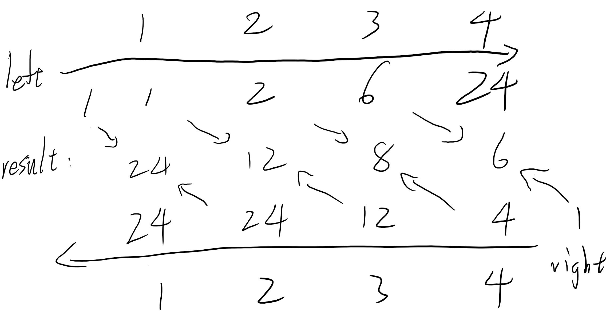
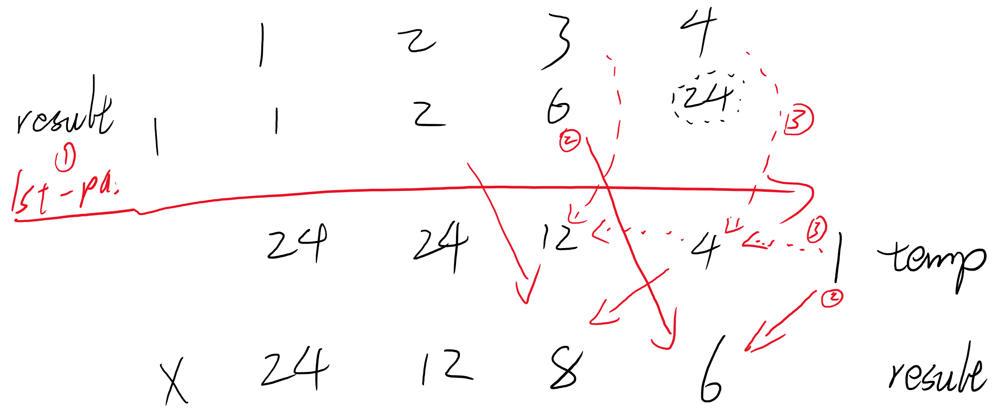

Implication : First multiply the numbers literately from left side, then do it again from right side.

[Reference Solution](https://leetcode.com/problems/product-of-array-except-self/discuss/65625/Python-solution-(Accepted)-O(n)-time-O(1)-space)

<br/>

First thought with O(n) space complexity :




```python
class Solution:
    def productExceptSelf(self, nums: List[int]) -> List[int]:
        leftSideMultiply = [1]
        rightSideMultiply = [1]
        n = len(nums)
        
        # Implication : First multiply the numbers literately from left side, then do it again from right side.
        for i in range(n) :
            leftSideMultiply.append( leftSideMultiply[i] * nums[i] )
            rightSideMultiply.append( rightSideMultiply[i] * nums[n - i - 1] )
        
        result = []        
        for i in range(n) :
            result.append( leftSideMultiply[i] * rightSideMultiply[n - i - 1] )
            
        return result              
```

<br/>

To improve, we can reuse the result array :



```python
class Solution:
    def productExceptSelf(self, nums: List[int]) -> List[int]:
        result = [1]
        n = len(nums)
        for i in range(n) :
            # Step 1 : multiply the numbers literately from left side.
            result.append( result[i] * nums[i] ) 
            
        temp = 1
        for i in range(n,0,-1) :
            # Step 2 : multiply from right side and save the product in temp.
            result[i] = result[i-1] * temp
            
            # Step 3 : update temp.
            temp *= nums[i-1]
            
        return result[1:]     
```

