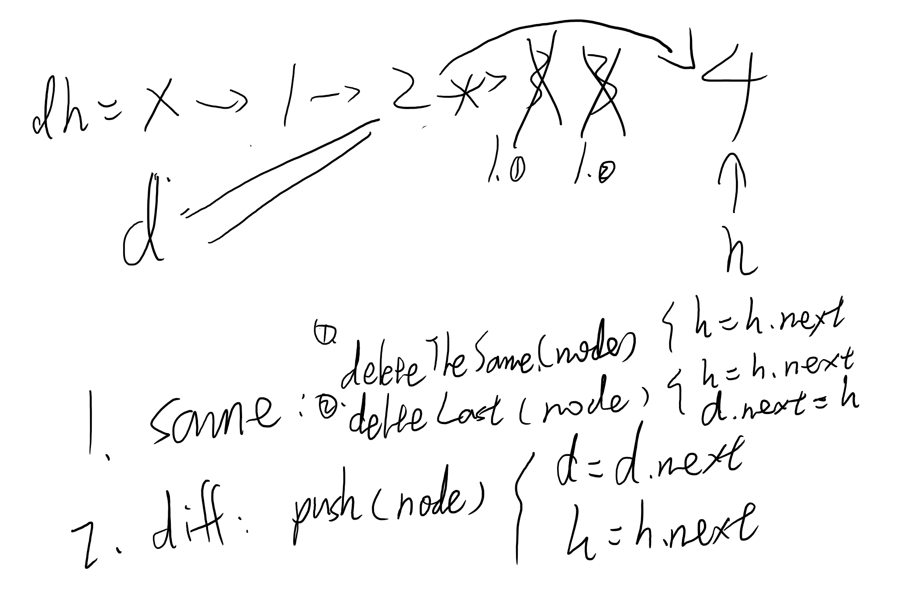

Hint : Start delete after finding duplicated nodes, then delete last node (head) at last.

[Reference Solution](https://leetcode.com/problems/remove-duplicates-from-sorted-list-ii/discuss/28336/Python-in-place-solution-with-dummy-head-node.)

<br/>




```python
# Definition for singly-linked list.
# class ListNode:
#     def __init__(self, x):
#         self.val = x
#         self.next = None

class Solution:
    def deleteDuplicates(self, head: ListNode) -> ListNode:
        dummyHead = dummy = ListNode(0)
        dummy.next = head

        dupFlag = False
        
        while head is not None and head.next is not None:
            # Find duplicated elements.
            if head.val == head.next.val :
                # Delete duplicated elements one by one.
                while head.next is not None and head.next.val == head.val :
                    head = head.next
                
                # Delete last duplicated element.
                head = head.next
                dummy.next = head
            else :
                # Skip different elements.
                dummy = dummy.next
                head = head.next
        
        return dummyHead.next
```

