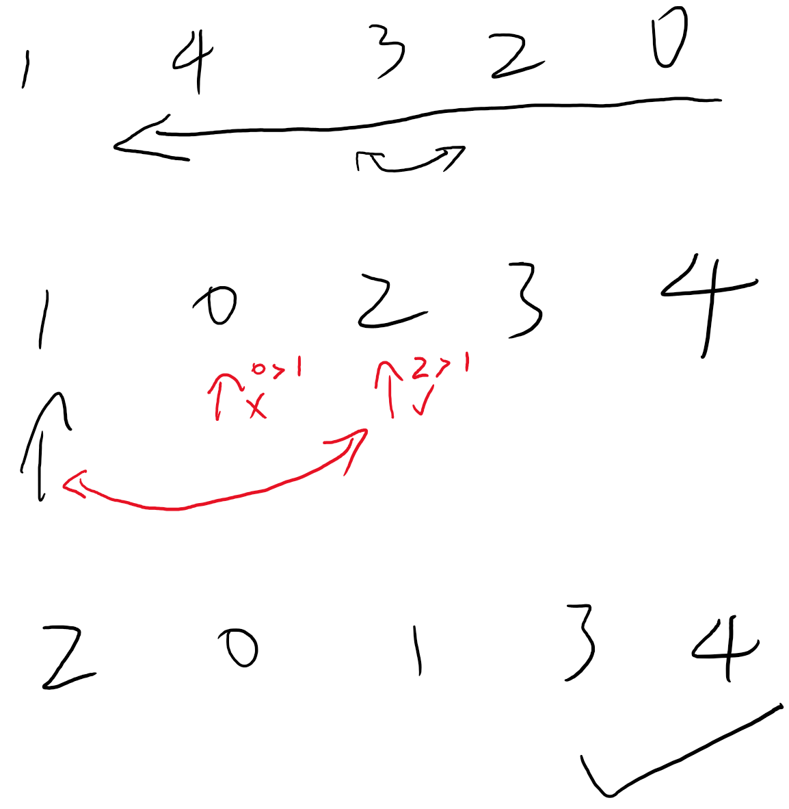

Implication : After day 1, cells[0] and cells[7] must be 0. So the total number of states is reduced from 2^8 to 2^6, which will save time and space.

[Reference Solution](https://leetcode.com/problems/next-permutation/discuss/13867/C%2B%2B-from-Wikipedia)

<br/>



```python
class Solution:
    def nextPermutation(self, nums: List[int]) -> None:
        """
        Do not return anything, modify nums in-place instead.
        """
        n = len(nums)
        # Search from the right side and reverse the inverted sorted subarray.
        i = n-1
        while i>0 and nums[i-1] >= nums[i] :
            i -= 1
        
        j=i
        k=n-1
        while j<k :
            nums[j], nums[k] = nums[k], nums[j]
            j += 1
            k -= 1
            
        # Implication : After the reversion, nums[i] <= ... <= nums[n-1] 
        # The next permutation of nums only change nums[i-1:] 
        # by swap position of nums[i-1] and first nums[j] greater than it behind it.
        if i>0 :
            for j in range(i, n):
                if nums[j] > nums[i-1] :
                    nums[j], nums[i-1] = nums[i-1], nums[j]
                    break
```

