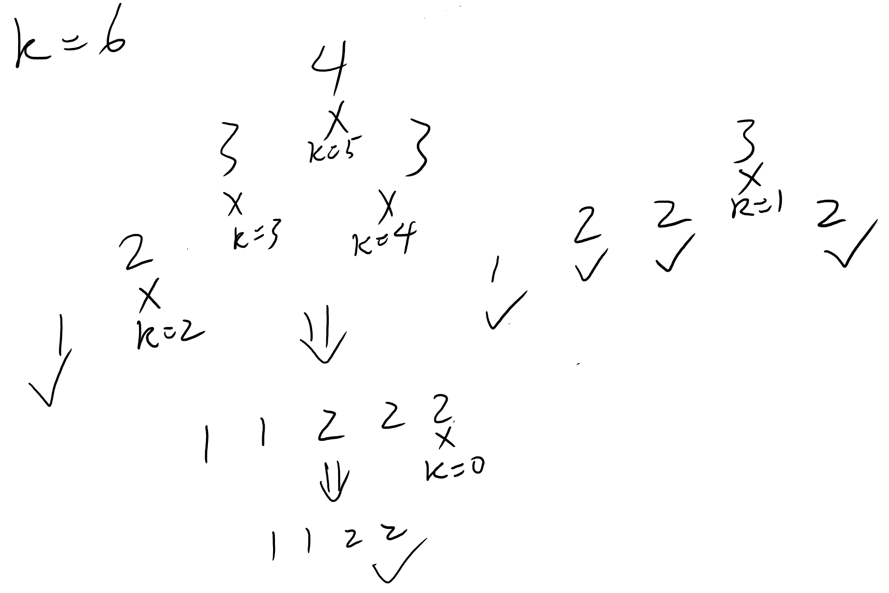

Implication :   
Remove the last value of current sequence while next number is less than it.   
Then the result sequence will be smallest one.  
If k > 0 at the end, it will also be in ascending order. 

[Reference Solution](https://leetcode.com/problems/remove-k-digits/discuss/88668/Short-Python-one-O(n)-and-one-RegEx)

<br/>



```python
class Solution:
    def removeKdigits(self, num: str, k: int) -> str:
        # Implication : Remove the last value of current sequence 
        # while next number is less than it. 
        # Then the result sequence will be smallest one.
        # If k > 0 at the end, it will also be in ascending order.
        result = []
        for c in num :
            while k > 0 and len(result) > 0 and result[-1] > c :
                result.pop()
                k -= 1
                
            result.append(c)
            
        # If k has not been reduced to 0, delete the values from the end.
        result = result[:len(result)-k]
        
        # Skip leading zeros.
        i = 0
        while i < len(result) and result[i] == '0' :
            i+=1
            
        # Concatenate final result string.
        result = ''.join(result[i:])
        
        #  Return '0' if all the valid values are removed.
        if result == '' :
            result = '0'
        
        return result            
```

