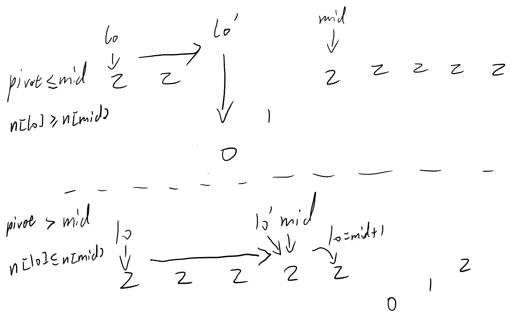
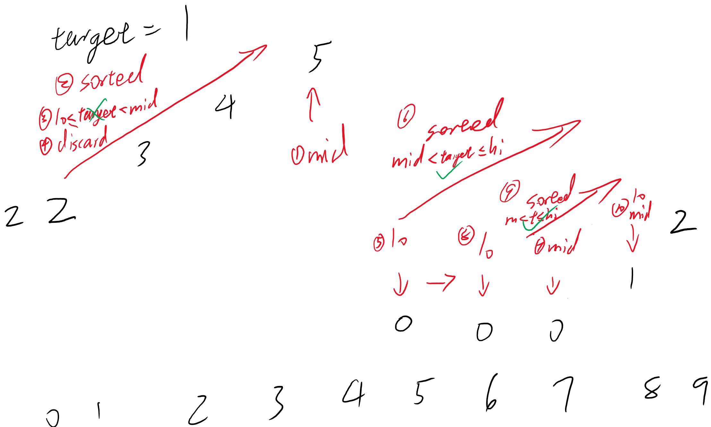

Implication :          
Implication : nums[lo] >= nums[mid] >= nums[hi] is impossible.  
If nums[lo] > nums[mid], nums[mid] <= nums[hi].  
i.e. either nums[lo:mid] or nums[mid+1:hi+1] or both are sorted.  
If nums[lo:mid] is not sorted, nums[mid+1:hi+1] must be sorted.  

[Reference Solution](https://leetcode.com/problems/search-in-rotated-sorted-array-ii/discuss/28195/Python-easy-to-understand-solution-(with-comments).)

<br/>



↑ Picture 1 : The process to skip duplicated elements.




↑ Picture 2 : Full process.


```python
class Solution:
    def search(self, nums: List[int], target: int) -> bool:
        n = len(nums)
        lo = 0
        hi = n - 1
        result = False
        while lo <= hi :
            mid = lo + (hi-lo) // 2
            if nums[mid] == target :
                result = True
                break
              
            ### KEY STEP ###
            # Deal with duplicated elements.
            while lo < mid and nums[lo] == nums[mid] :
                lo += 1
                
            # At least either nums[lo:mid] or nums[mid+1:hi+1] is sorted.
            if nums[lo] <= nums[mid] : 
                # nums[lo:mid] is sorted.
                if nums[lo] <= target < nums[mid] :                    
                    hi = mid - 1
                else :
                    # target not found in nums[lo:mid], maybe in nums[mid+1:hi+1].
                    lo = mid + 1
            else :
                # Implication : nums[lo] >= nums[mid] >= nums[hi] is impossible.
                # If nums[lo] > nums[mid], nums[mid] <= nums[hi].
                # i.e. either nums[lo:mid] or nums[mid+1:hi+1] or both are sorted.
                # If nums[lo:mid] is not sorted, nums[mid+1:hi+1] must be sorted.
                if nums[mid] < target <= nums[hi] :                    
                    lo = mid + 1
                else :
                    # target not found in nums[mid+1:hi+1], maybe in nums[lo:mid].
                    hi = mid - 1
                    
        return result
```

